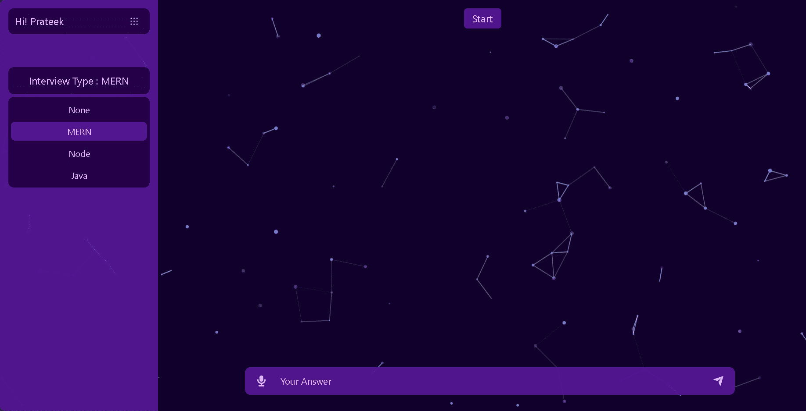

# [Prodigy : AI Powered Interview Mastery](https://prodigy-zeta.vercel.app/)

## Visit : https://prodigy-zeta.vercel.app

### Prodigy is your go-to web app for targeted subject learning. Select your topic, answer interview-style questions, and receive insightful feedback powered by OpenAI. Elevate your knowledge effortlessly with Prodigy.

## Features :-

- User can Register / LogIn.
- Can select subject between MERN, Node, Java to commence the interview.
- User can send response using the Voice Assistant feature.
- User can get assistence with AI generated interview based questions.

## Tech Stacks Used :-

#### `React | Tailwind Css | Chakra UI | Express | MongoDB`

## Installation :-

### Start The Front - End Server :

- Clone Repo : `git clone https://github.com/prateekshuklaps0/AI-Powered-Interview-Mastery.git`
- Install Dependencies : `cd Front-End` `npm install`
- Start the Front-End Server : `npm run dev`

### Start The Back - End Server :

- Clone Repo : `git clone https://github.com/prateekshuklaps0/AI-Powered-Interview-Mastery.git`
- Install Dependencies : `cd Back-End` `npm install`
- Start the Front-End Server : `npm run server`

